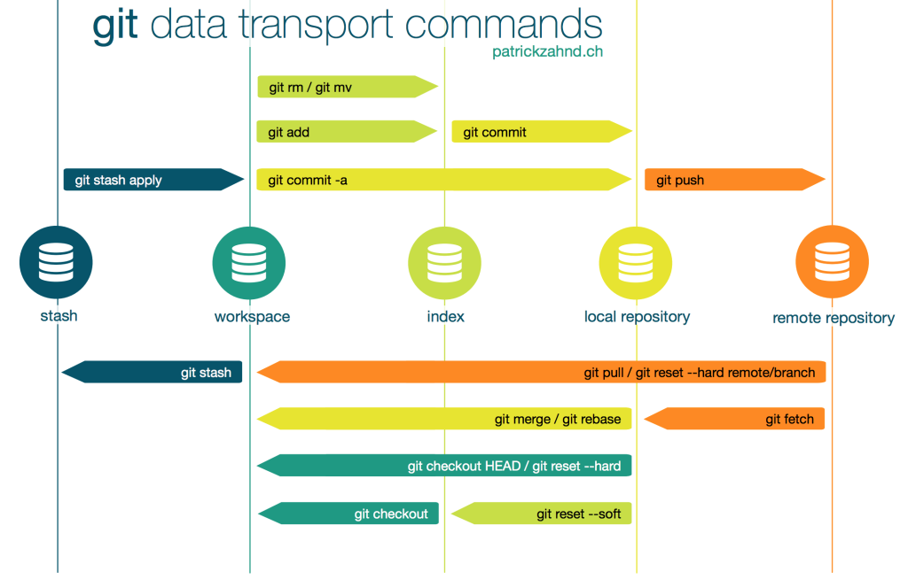

# TP - git et svn - M1

## git

### Exercice 1 / Modifications locales

- Ouvrir le fichier "Note.java"
- La méthode portant votre nom donne la note que vous aurez (sur 10)
- Modifier la ligne qui vous concerne et donnez vous une note
- Faire un commit
- Visualiser votre commit

Commandes utiles : git add, git commit, git log

### Exercice 2 / Modifications distantes

- Faire un push de votre commit
- Qu'est-ce qui se passe ?

Commandes utiles : git push, git pull

### Exercice 3 / Conflits et fusion

- Corriger la méthode moyenne qui ne divise pas par le nombre d'étudiant
- Faire un push de votre commit
- Qu'est-ce qui se passe ?

Commandes utiles : git push, git add, git merge

### Exercice 4 / Création de branche

- Faite une branche (nommée correctement, par exemple avec votre nom)
- Implémentez une méthode "max" qui trouve la note maximum du groupe de votre TP
- Faite votre commit, et faire un push de votre branche

Commandes utiles : git branch, git checkout, git commit, git push

### Exercice 5 / Merge de branche

- Visualisez les branches de vos camarades sur le dépôt
- Faire un merge d'une de ces branches dans la votre
- Qu'est ce qui se passe ?

Commandes utiles : git branch, git merge

## svn

- Faire un checkout du dépôt pour votre TP (voir au tableau pour LOGIN et GROUPE)
- Ajouter un fichier et l'ajouter a SVN
- Faire un commit
- Quelle est la différence avec git ?
- Faire un update
- Quelle est la différence avec git ?

Commandes utiles : svn checkout, svn add, svn commit, svn update

## Correspondance git / svn

- git clone = svn checkout
- git add = svn add
- git commit + git push = svn commit
- git pull = svn update

## Installation serveur git

Comme exercice facultatif, installer un serveur git pour partager du contenu.

- Installer sshd sur le serveur (normalement pré-installé)
- Installer git sur le serveur
- Initialiser un dépôt vide sur le serveur
```bash
    mkdir -p /var/depot
    cd /var/depot
    git init --bare m1
```
- Récupérer ce dépôt sur la même machine afin de tester
```bash
    cd ~
    git clone /var/depot/m1
    cd m1
```
- Récupérer ce dépôt à partir d'une autre machine, le USER est votre login / mdp sur cette machine, et IP est l'IP de la machine (doit être accessible).
```bash
    cd ~
    git clone USER@IP:/var/depot/m1
    cd m1
```

## Cheat sheets




